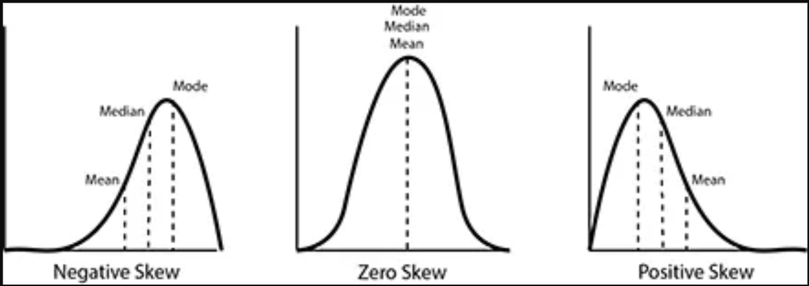
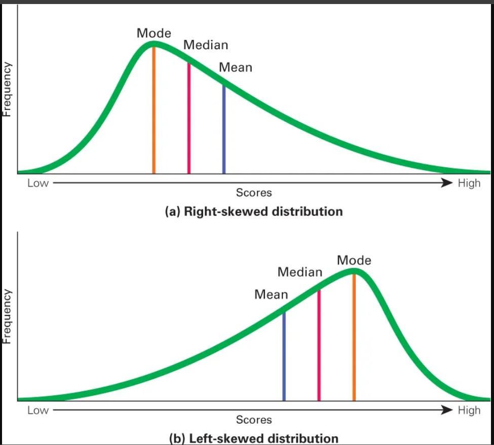

## **Lecture Notes: Decoding Skewness - Understanding Data Distribution**

**Guide:** Vineet Tiwari

**Course:** Advanced Data Analysis & Statistical Modeling

**Lecture Topic:** Beyond Normality: Diagnosing, Quantifying, and Correcting for Skewness

---

### **1. Introduction: The Imperfect Bell Curve**

Welcome, class. Throughout our studies, the Normal Distribution—the elegant, symmetric bell curve—has been our default model. But the real world is messy. Data is often lopsided, pulled in one direction by extreme values or natural boundaries.

Today, we dive deep into **Skewness**, the statistical measure of this asymmetry. Understanding skewness is not an academic exercise; it is a critical diagnostic skill that dictates everything from which summary statistics we report to which models we build. Ignoring it can lead to flawed insights, invalid tests, and poor predictions.

---

### **2. What is Skewness? The Core Concept**

**Skewness** is a measure of the asymmetry of the probability distribution of a real-valued random variable about its mean.

*   **Right (Positive) Skewness:** The right tail of the distribution is longer or fatter than the left.
    *   **Visual Cue:** The mass of the distribution is concentrated on the left.
    *   **Relationship:** `Mean > Median > Mode`
    *   **Example:** Income distribution. Most people have average to low incomes, but a few very high incomes pull the mean far to the right of the median.

*   **Left (Negative) Skewness:** The left tail of the distribution is longer or fatter than the right.
    *   **Visual Cue:** The mass of the distribution is concentrated on the right.
    *   **Relationship:** `Mean < Median < Mode`
    *   **Example:** Age at retirement. Most people retire around a common age (e.g., 65), but some retire early, creating a long left tail.





**Why it matters profoundly:**
1.  **Choice of Statistical Tests:** Parametric tests (t-tests, ANOVA, linear regression) assume normally distributed errors. Skewness violates this assumption.
2.  **Representative Summaries:** The mean is highly sensitive to skew. For skewed data, the **median is a much better measure of central tendency.**
3.  **Risk and Outlier Detection:** Skewness signals the presence and direction of extreme values (outliers), which is crucial in finance and quality control.
4.  **Model Performance:** Machine learning models, especially those using squared error loss, can be unduly influenced by skewed data, leading to poor predictions.

---

### **3. Visual Intuition: Seeing the Asymmetry**

Before calculating a single number, **always visualize your data.**
*   **Histogram & Kernel Density Estimate (KDE):** The simplest way to spot skew. Is one tail visibly longer? Is the peak off-center?
*   **Q-Q Plot (Quantile-Quantile Plot):** The gold standard for assessing normality. You plot your data's quantiles against the quantiles of a normal distribution. If the points roughly form a straight line, the data is normal. If they curve away, it indicates skew.
    *   **Right-Skew:** Points curve upward on the right.
    *   **Left-Skew:** Points curve downward on the left.

---

### **4. Quantifying Skewness: The Formulas**

We move from visual assessment to numerical measurement.

#### **A. Moment Coefficient (Pearson's Moment Coefficient of Skewness)**
This is the most common measure, based on the third standardized moment.
$$
g_1 = \frac{\frac{1}{n}\sum_{i=1}^{n}(x_i - \bar{x})^3}{s^3}
$$
Where `s` is the sample standard deviation.
*   **Interpretation:** `g1 = 0` (normal), `g1 > 0` (positive skew), `g1 < 0` (negative skew).
*   **Limitation:** Sensitive to outliers, as it uses the mean and standard deviation.

#### **B. Bowley's Coefficient (Quartile Skewness)**
A robust, non-parametric measure based on quartiles.
$$
\text{Skew}_{\text{Bowley}} = \frac{(Q_3 - Q_2) - (Q_2 - Q_1)}{Q_3 - Q_1} = \frac{Q_3 + Q_1 - 2Q_2}{Q_3 - Q_1}
$$
*   **Interpretation:** Same as above. Ranges from -1 to +1.
*   **Advantage:** Not affected by extreme outliers. Use this when your data has heavy tails or you suspect extreme values.

---

### **5. The Practical Workflow for Handling Skewed Data**

This is your action plan when you encounter real-world data.

1.  **EXPLORE:** Create a histogram and a Q-Q plot. Compare the mean and median.
2.  **QUANTIFY:** Calculate both the Moment and Bowley skewness coefficients. If they disagree significantly, you likely have outliers.
3.  **DECIDE & REMEDY:**
    *   **Mild Skew:** You may proceed with caution for some robust models.
    *   **Moderate to Strong Skew:** Apply a transformation to make the data more symmetric.
    *   **Severe Skew with Outliers:** Use robust statistics (median, IQR) and models (quantile regression).
4.  **MODEL:** After any transformation, build your model. **Crucially, check the skewness of your model's residuals.** Well-behaved residuals should be roughly symmetric.
5.  **REPORT:** For skewed data, always report the **median and interquartile range (IQR)** alongside the mean and standard deviation.

---

### **6. Correcting for Skewness: Transformations**

Transformations apply a mathematical function to each data point to compress the long tail and make the distribution more symmetric.

*   **Log Transformation (`log(x)`, `log1p(x)`):** The go-to solution for right-skewed data. Use `log1p` (log(1+x)) if your data contains zeros. Perfect for monetary values, sizes, etc.
*   **Square Root Transformation (`sqrt(x)`):** Weaker than log. Good for right-skewed count data.
*   **Box-Cox Transformation:** A more sophisticated, parameterized family of transformations that includes the log and square root as special cases. **Requires strictly positive data.**
    `x_bc, lambda = boxcox(x)`
*   **Yeo-Johnson Transformation:** An extension of Box-Cox that can handle both positive and negative data. Often implemented in machine learning libraries like `scikit-learn`.

**Important:** Remember to reverse the transformation (*back-transform*) any predictions you make to return to the original scale for interpretation.

---

### **7. Advanced Considerations: Modeling with Skew**

*   **Generalized Linear Models (GLMs):** Instead of transforming the data, you can use a GLM with a non-normal error distribution and a link function. For right-skewed data, a **Gamma distribution with a log-link** is often ideal.
*   **Quantile Regression:** This powerful technique models the relationship between variables for different parts of the distribution (e.g., the median, the 90th percentile). It makes no assumptions about the distribution of the data and is completely robust to skewness and outliers.

---

### **8. Key Takeaways & Reporting Checklist**

1.  **Never Assume Normality:** Always check for skewness as a first step in analysis.
2.  **Visualize First:** Use histograms and Q-Q plots to diagnose the problem.
3.  **Choose the Right Tool:**
    *   Use the **mean & SD** for symmetric data.
    *   Use the **median & IQR** for skewed data.
    *   Use the **Moment coefficient** for a standard measure.
    *   Use the **Bowley coefficient** for robust, outlier-resistant measurement.
4.  **Transform Wisely:** Use log, Box-Cox, or Yeo-Johnson transformations to correct for skewness before modeling.
5.  **Validate Your Model:** The ultimate test is the distribution of your residuals. They should be approximately normal.
6.  **Report Transparently:** Always state which measures and transformations you used.

---

### **9. Hands-On Python Demonstration**

Let's walk through the provided code to see these concepts in action.

```python
# SETUP (Run this first)
import numpy as np
import pandas as pd
from scipy.stats import skew, skewtest, boxcox
from sklearn.preprocessing import PowerTransformer
import matplotlib.pyplot as plt
import statsmodels.api as sm

# 1. GENERATE SKEWED DATA
rng = np.random.default_rng(7)
x_pos = rng.lognormal(mean=0.0, sigma=0.9, size=5000) # Right-skewed
x_neg = -rng.lognormal(mean=0.0, sigma=0.9, size=5000) # Left-skewed
x_neg = x_neg - x_neg.min() + 1e-6
df = pd.DataFrame({"right_skew": x_pos, "left_skew": x_neg})

# 2. CALCULATE SKEWNESS
def bowley_skew(x):
    q1, q2, q3 = np.percentile(x, [25, 50, 75])
    return (q3 + q1 - 2*q2) / (q3 - q1)

summary = []
for col in df.columns:
    x = df[col].values
    summary.append({
        "feature": col,
        "mean": np.mean(x),
        "median": np.median(x),
        "moment_skew": skew(x, bias=False),
        "bowley_skew": bowley_skew(x),
    })
pd.DataFrame(summary) # Observe mean > median for right_skew, and vice versa.

# 3. VISUALIZE (Right-skewed example)
col = "right_skew"
x = df[col].values
# Histogram
plt.hist(x, bins=60); plt.title(f"Histogram of {col}"); plt.show()
# Q-Q Plot
sm.qqplot(x, line='s'); plt.title(f"Q-Q Plot of {col}"); plt.show() # See the upward curve?

# 4. APPLY TRANSFORMATIONS
x_log = np.log(x) # Log transform
x_bc, bc_lambda = boxcox(x) # Box-Cox transform
# Check their skewness now
print("Original Skew:", skew(x, bias=False))
print("Log Transformed Skew:", skew(x_log, bias=False))
print(f"Box-Cox (λ={bc_lambda:.3f}) Skew:", skew(x_bc, bias=False))
# The transformed data should have skewness much closer to zero.

# 5. MODELING EXAMPLE (With a log-link)
n = 2000
X = rng.normal(size=(n, 3))
beta = np.array([0.5, -0.3, 0.2])
noise = rng.lognormal(mean=0.0, sigma=0.6, size=n)
y = np.exp(X @ beta) * noise # Create a right-skewed target variable

# Fit OLS on log(y) - This is a common workaround
X_ = sm.add_constant(X)
model = sm.OLS(np.log(y), X_).fit()
# Check if residuals are now normal/symmetric
residuals = model.resid
print("Residual Skew:", skew(residuals, bias=False))
sm.qqplot(residuals, line='s'); plt.title("Q-Q Plot of Model Residuals"); plt.show()
```

**Next Lecture:** We will dive into **Unlocking the World of Probability**, where we'll learn the fundamental language of uncertainty and randomness. We'll explore probability theory, conditional probability, Bayes' theorem, and various probability distributions that form the foundation of statistical inference.

**Topics to be covered:**
- Understanding probability as the language of uncertainty
- Sample spaces, events, and probability rules
- Conditional probability and independence
- Bayes' theorem and its applications
- Common probability distributions (Binomial, Poisson, Normal)
- Expected value and variance in probability
- Real-world applications in weather forecasting, finance, and medicine

**Are there any questions?**