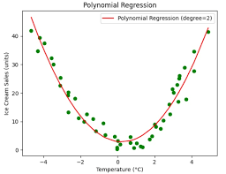
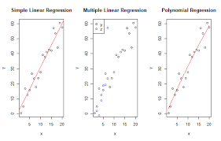
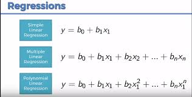

### Introduction to Regression Analysis
Regression analysis is a foundational set of statistical methods used to model and analyze the relationship between a **dependent variable** (often called the target, outcome, or response variable) and one or more **independent variables** (often called features, predictors, or explanatory variables).

The core goal is to find a mathematical equation that defines the dependent variable as a function of the independent variable(s). This equation can then be used for:
*   **Explanation:** Understanding how changes in the predictors are associated with changes in the outcome.
*   **Prediction:** Forecasting future values of the dependent variable.

---
## 1. Simple Linear Regression

Simple Linear Regression (SLR) models the relationship between **one** independent variable and a dependent variable by fitting a **linear equation** to the observed data.

#### Theory & Model Representation

The model assumes the relationship can be described by a straight line. The equation is:

**`y = β₀ + β₁x + ε`**

Where:
*   **`y`** is the **dependent variable** (the variable we want to predict or explain).
*   **`x`** is the **independent variable** (the variable we use for prediction).
*   **`β₀`** (beta-zero) is the **y-intercept**. It represents the expected mean value of `y` when `x` is equal to zero.
*   **`β₁`** (beta-one) is the **slope** or **regression coefficient**. It represents the expected change in `y` for a one-unit change in `x`.
*   **`ε`** (epsilon) is the **error term** or **residual**. It accounts for the variability in `y` that cannot be explained by the linear relationship with `x`. It represents the distance between the actual data point and the regression line.

#### The Goal: Finding the Best-Fit Line

We never know the true population parameters `β₀` and `β₁`. Instead, we use sample data to estimate them. The estimated regression line is:

**`ŷ = b₀ + b₁x`**

Where:
*   **`ŷ`** (y-hat) is the **predicted value** of `y` for a given `x`.
*   **`b₀`** is the estimated y-intercept.
*   **`b₁`** is the estimated slope.

The goal is to find the values of `b₀` and `b₁` that make the predicted values `ŷ` as close as possible to the actual values `y`.

#### Method: Ordinary Least Squares (OLS)

The most common method for finding the "best-fit" line is **Ordinary Least Squares (OLS)**. OLS minimizes the sum of the squares of the residuals (the vertical distances between the data points and the line).

The residual for the `i`-th observation is: **`e_i = y_i - ŷ_i`**

The OLS method finds `b₀` and `b₁` that minimize the **Sum of Squared Errors (SSE)**:
**`SSE = Σ(y_i - ŷ_i)² = Σ(e_i)²`**

The formulas for the OLS estimators are:
*   **`b₁ = Σ[(x_i - x̄)(y_i - ȳ)] / Σ(x_i - x̄)²`** (Covariance of x and y / Variance of x)
*   **`b₀ = ȳ - b₁x̄`**

Where `x̄` and `ȳ` are the sample means.

#### Key Assumptions
For the OLS estimators to be the "Best Linear Unbiased Estimators" (BLUE), the following assumptions must hold:
1.  **Linearity:** The relationship between X and Y is linear.
2.  **Independence:** Observations are independent of each other.
3.  **Homoscedasticity:** The variance of the error term `ε` is constant across all values of X.
4.  **Normality:** The error terms `ε` are normally distributed (important for hypothesis testing and confidence intervals).

---

## 2. Multiple Linear Regression

Multiple Linear Regression (MLR) extends SLR by modeling the relationship between a dependent variable and **two or more** independent variables.

#### Theory & Model Representation

The model equation becomes:

**`y = β₀ + β₁x₁ + β₂x₂ + ... + βₚxₚ + ε`**

Where:
*   **`y`** is the dependent variable.
*   **`x₁, x₂, ..., xₚ`** are the independent variables.
*   **`β₀`** is the y-intercept (the value of `y` when all `x` are zero).
*   **`β₁, β₂, ..., βₚ`** are the partial regression coefficients.
    *   **`β₁`** represents the change in the mean response, `y`, per unit change in `x₁`, **when all other predictors are held constant.**
*   **`ε`** is the error term.

#### The Goal and Method (OLS)

The goal remains the same: to find the estimated coefficients `b₀, b₁, ..., bₚ` that minimize the Sum of Squared Errors (SSE). The estimated regression equation is:

**`ŷ = b₀ + b₁x₁ + b₂x₂ + ... + bₚxₚ`**

While the formulas for the coefficients are more complex and require linear algebra (`b = (XᵀX)⁻¹Xᵀy`), the principle is identical to SLR.

#### Interpretation of Coefficients

This is a crucial difference from SLR. In MLR, the coefficient `βᵢ` for a predictor `xᵢ` represents the **marginal effect** of that predictor, **holding all other predictors in the model constant.** This allows us to isolate the unique contribution of each variable.

#### Key Assumptions
The assumptions for MLR are the same as for SLR (Linearity, Independence, Homoscedasticity, Normality), with one critical addition:
5.  **No Perfect Multicollinearity:** The independent variables should not be perfectly correlated with each other. High multicollinearity makes it difficult to determine the individual effect of each predictor and inflates the standard errors of the coefficients.

---

## 3. Polynomial Regression

Polynomial Regression is a form of **Multiple Linear Regression** where the relationship between the independent variable `x` and the dependent variable `y` is modeled as an **n-th degree polynomial** in `x`. Despite the curved fit, it is considered a linear model because it is linear in the **coefficients**.

#### Theory & Model Representation

The model for a single independent variable `x` with degree `d` is:

**`y = β₀ + β₁x + β₂x² + ... + β_dx^d + ε`**

Notice that we have created new features from `x` (`x², x³, ...`). The model treats these as separate independent variables.

**Example (Quadratic Regression, d=2):**
**`y = β₀ + β₁x + β₂x² + ε`**

#### Why Use It?

Polynomial regression is used when the relationship between the variables is **inherently nonlinear**. A straight line is a poor fit for curved relationships. By adding higher-order terms, we can capture the curvature in the data.

*   **`x²`** can capture a single "U" or "inverted U" shape.
*   **`x³`** can capture an "S" shape.

#### The Goal and Method (OLS)

The method is identical to Multiple Linear Regression. We simply redefine our features:
*   Let `z₁ = x`, `z₂ = x²`, ..., `z_d = x^d`.

Our polynomial model becomes:
**`y = β₀ + β₁z₁ + β₂z₂ + ... + β_dz_d + ε`**

This is now a standard MLR problem! We use OLS to find the coefficients `b₀, b₁, ..., b_d`.

#### Important Considerations

1.  **Degree of the Polynomial (`d`):**
    *   A degree that is **too low** will result in **underfitting** (the model is too simple and misses the trend).
    *   A degree that is **too high** will result in **overfitting** (the model learns the noise in the data and doesn't generalize well to new data). The curve will pass very close to all training points but become wildly inaccurate elsewhere.
2.  **Feature Scaling:** When using higher-degree terms, it is often essential to scale the features (e.g., Standardization) because the values of `x²`, `x³`, etc., can become very large and cause numerical instability.

---

### Summary Comparison

| Feature | Simple Linear Regression | Multiple Linear Regression | Polynomial Regression |
| :--- | :--- | :--- | :--- |
| **Purpose** | Model a linear relationship with **one** predictor. | Model a linear relationship with **multiple** predictors. | Model a **non-linear** relationship with one predictor. |
| **Equation** | `y = β₀ + β₁x + ε` | `y = β₀ + β₁x₁ + ... + βₚxₚ + ε` | `y = β₀ + β₁x + β₂x² + ... + ε` |
| **Coefficient Interpretation** | Change in `y` per unit change in `x`. | Change in `y` per unit change in `xᵢ`, **holding all other x's constant**. | Coefficients for `x²`, `x³`, etc., define the shape of the curve. Not independently interpretable. |
| **Model Type** | Linear Model | Linear Model | **Linear in parameters**, but non-linear in the input variable `x`. |
| **Key Challenge** | Establishing causality. | Multicollinearity. | Choosing the correct polynomial degree to avoid over/underfitting. |

In essence, you can think of Polynomial Regression as a clever application of Multiple Linear Regression by creating new, non-linear features from your original data to capture more complex patterns.

.jpg>)

