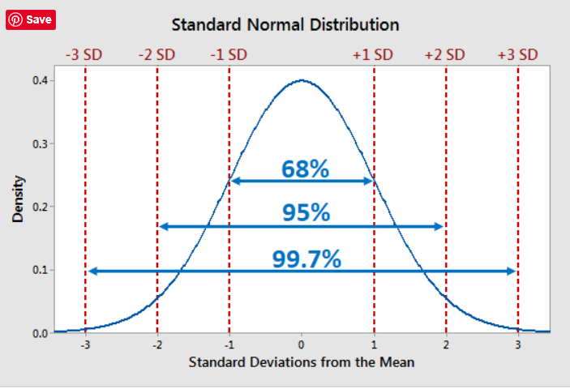

## **Lecture Notes: The Z-Score Journey - Understanding Distributions and Standardization**

**Professor:** Vineet Tiwari

**Course:** Foundations of Inferential Statistics

**Lecture Topic:** The Normal Distribution, Standardization, and the Power of the Z-Score

---

### **1. Introduction: The Need for a Common Language**

Welcome, class. In our previous sessions, we learned how to describe single datasets. But what if we want to compare scores from *different* datasets? For example:
*   Is a score of 85 on a difficult physics test better or worse than a score of 90 on an easier history test?
*   Is a newborn's weight of 3.5 kg more unusual than their height of 55 cm?

To answer these questions, we need a way to translate raw scores into a **standardized, universal language of probability and relative standing.** This is the power of the **Z-Score** and the **Normal Distribution**. They form the absolute bedrock of inferential statistics, hypothesis testing, and much of machine learning.

---

### **2. The Normal Distribution: The "Royal Family" of Distributions**

The Normal (or Gaussian) Distribution is not just any distribution; it is the most important distribution in statistics. First rigorously described by **Carl Friedrich Gauss** in 1809, its characteristic **bell-shaped curve** appears everywhere in the natural and social sciences.

#### **A. Why is it So Common?**
It arises naturally when a characteristic is influenced by a large number of independent, small, random factors. Examples include:
*   **Biological:** Heights and weights of a population, blood pressure readings.
*   **Physical:** Measurement errors in experiments.
*   **Social:** Test scores, IQ scores, manufacturing dimensions.

#### **B. Key Properties**
The normal distribution is defined by two parameters:
1.  **Mean (μ):** The center of the distribution. The peak of the bell curve.
2.  **Standard Deviation (σ):** The spread or width of the distribution.

Its properties are mathematically perfect:
*   **Symmetry:** It is perfectly symmetric around the mean.
*   **Mean = Median = Mode:** All three measures of central tendency are equal and located at the center.
*   **Asymptotic Tails:** The tails get closer and closer to the horizontal axis but never actually touch it, meaning theoretically, any value is possible, albeit with infinitesimal probability.

#### **C. The Empirical Rule (68-95-99.7 Rule)**
This is a crucial rule of thumb for any normally distributed data:
*   **≈68%** of the data falls within **±1 standard deviation** of the mean.$\scriptsize (μ - σ, μ + σ)$
*   **≈95%** of the data falls within **±2 standard deviations** of the mean.$\scriptsize (μ - 2σ, μ + 2σ)$
*   **≈99.7%** of the data falls within **±3 standard deviations** of the mean.$\scriptsize (μ - 3σ, μ + 3σ)$
This rule allows us to quickly estimate probabilities and identify outliers.



---

### **3. The Standard Normal Distribution: The Golden Standard**

While there are infinitely many normal distributions (one for every possible μ and σ), we can transform them all into one special case: the **Standard Normal Distribution**.

*   **Mean (μ) = 0**
*   **Standard Deviation (σ) = 1**
*   **Variance (σ²) = 1**

Its Probability Density Function (PDF) is:
$$
f(z) = \frac{1}{\sqrt{2\pi}} e^{-\frac{z^2}{2}}
$$
The total area under this curve, representing the total probability, is always equal to 1.

---

### **4. The Z-Score: The Transformation Formula**

The magic of converting *any* normal distribution to the standard normal is achieved through the **Z-Score**.

#### **A. The Formula**
For a data point $X$ from a distribution with mean $μ$ and standard deviation $σ$, its Z-score is:
$$
Z = \frac{X - \mu}{\sigma}
$$

#### **B. Interpretation**
The Z-score tells us **how many standard deviations above or below the mean** a raw score is.
*   **Z = 0:** The score is exactly at the mean.
*   **Z = +1.5:** The score is 1.5 standard deviations *above* the mean.
*   **Z = -2.0:** The score is 2.0 standard deviations *below* the mean.

This transformation solves our initial problem: **It allows for direct comparison of scores from different datasets.** A Z-score of +1.5 in physics is directly comparable to a Z-score of +1.5 in history; both are equally above average in their respective contexts.

#### **C. Critical Values**
In statistical inference, certain Z-scores mark the boundaries of "unusual" or "extreme" values. These are called critical values.
*   For a **95% confidence interval**, the critical Z-values are approximately **±1.96**. This means 95% of the data lies between Z = -1.96 and Z = +1.96.
*   For a **99% confidence interval**, the critical values are approximately **±2.576**.

---

### **5. Applications of Z-Scores: From Classroom to Clinic**

*   **Education:** Standardized tests like the SAT and GRE are inherently based on Z-scores (they are then rescaled to numbers like 200-800). They allow universities to compare students from different schools and curricula fairly.
*   **Manufacturing & Quality Control (Six Sigma):** In processes, the Z-score measures how far a product's dimension is from the target specification. A high absolute Z-score indicates a defect. The goal of Six Sigma is to reduce process variation so that the specification limits are at least ±6σ from the mean.
*   **Medicine:** Lab results are often interpreted using Z-scores. A patient's result is compared to the reference range of a healthy population. A Z-score outside of ±2 might indicate a potential health issue. Z-scores are also used to track pediatric growth charts.

---

### **6. Relationship to Other Distributions**

It's important to see how the normal distribution fits into the larger ecosystem.
*   **Uniform Distribution:** Every outcome has an equal probability (e.g., a fair die roll). It is rectangular, not bell-shaped.
*   **Binomial Distribution:** Models the number of successes in$\scriptsizen$ independent binary trials (e.g., number of heads in 10 coin flips). **Crucially, as$\scriptsizen$ becomes large, the binomial distribution begins to closely approximate a normal distribution.** This is a preview of the Central Limit Theorem.
*   **Normal Distribution:** The continuous, symmetric limit of many other distributions, including the binomial.

---

### **7. Hands-On Python: Calculating and Using Z-Scores**

Let's see how to work with Z-scores in Python.

```python
# SETUP
import numpy as np
from scipy.stats import norm
import matplotlib.pyplot as plt

# 1. MANUAL Z-SCORE CALCULATION
print("=== MANUAL Z-SCORE CALCULATION ===")
# Example: Test scores in two classes
physics_scores = np.array([75, 80, 65, 90, 55]) # A harder test
history_scores = np.array([82, 88, 75, 95, 70]) # An easier test

# A student gets 85 in Physics and 90 in History. Which is better?
score_physics = 85
score_history = 90

# Calculate mean and std for each dataset
mu_phys = np.mean(physics_scores)
sigma_phys = np.std(physics_scores, ddof=1) # ddof=1 for sample standard deviation

mu_hist = np.mean(history_scores)
sigma_hist = np.std(history_scores, ddof=1)

# Calculate Z-scores
z_physics = (score_physics - mu_phys) / sigma_phys
z_history = (score_history - mu_hist) / sigma_hist

print(f"Physics: Mean = {mu_phys:.2f}, SD = {sigma_phys:.2f}, Score = {score_physics}, Z = {z_physics:.2f}")
print(f"History: Mean = {mu_hist:.2f}, SD = {sigma_hist:.2f}, Score = {score_history}, Z = {z_history:.2f}")
print(f"Interpretation: The student performed {z_physics:.2f} SDs above average in Physics and {z_history:.2f} SDs above average in History.")
# The higher Z-score indicates the better relative performance.

# 2. USING THE STANDARD NORMAL TABLE (via scipy.stats)
print("\n=== USING THE STANDARD NORMAL DISTRIBUTION ===")
# What is the probability that a randomly selected data point has a Z-score less than 1.25?
z_value = 1.25
probability_less_than_z = norm.cdf(z_value) # Cumulative Distribution Function
print(f"P(Z < {z_value}) = {probability_less_than_z:.4f}")

# What is the probability that a Z-score is greater than 1.25?
probability_greater_than_z = 1 - norm.cdf(z_value)
print(f"P(Z > {z_value}) = {probability_greater_than_z:.4f}")

# What is the probability that a Z-score is between -1.5 and 1.5?
prob_between = norm.cdf(1.5) - norm.cdf(-1.5)
print(f"P(-1.5 < Z < 1.5) = {prob_between:.4f}") # Should be close to the Empirical Rule value of 0.8664

# Find the critical Z-value for a 95% confidence interval (2.5% in each tail)
z_critical_95 = norm.ppf(0.975) # ppf = Percent Point Function (inverse of CDF)
print(f"Z-critical value for 95% confidence: ±{z_critical_95:.4f}")

# 3. VISUALIZING THE STANDARD NORMAL CURVE
print("\n=== VISUALIZING THE STANDARD NORMAL ===")
z = np.linspace(-4, 4, 1000) # Create a range of Z-scores from -4 to +4
pdf = norm.pdf(z) # Calculate the PDF for each Z

plt.figure(figsize=(10, 6))
plt.plot(z, pdf, 'b-', linewidth=2, label='Standard Normal PDF')
plt.title('The Standard Normal Distribution (μ=0, σ=1)')
plt.xlabel('Z-score')
plt.ylabel('Probability Density')
plt.fill_between(z, pdf, where=(z > -1.96) & (z < 1.96), color='green', alpha=0.3, label='95% Confidence Region')
plt.fill_between(z, pdf, where=(z < -1.5), color='red', alpha=0.5, label='P(Z < -1.5)')
plt.axvline(x=0, color='k', linestyle='--', label='Mean (Z=0)')
plt.legend()
plt.grid(True, alpha=0.3)
plt.show()
```

**Expected Output & Analysis:**
The code will calculate that the student's performance in Physics has a higher Z-score, indicating it was the *relatively* better performance. It will then show how to use the$\scriptsizenorm.cdf()$ function to find probabilities associated with Z-scores, confirming the Empirical Rule. Finally, it will generate a plot of the standard normal curve, shading the 95% confidence region and a tail area.

---

### **8. Key Takeaways and Summary**

1.  **Universal Language:** The **Z-score** provides a standardized way to describe the location of a data point within a distribution and to compare across different distributions.
2.  **The Normal Distribution:** Is a symmetric, bell-shaped distribution that is fundamental to statistics due to its natural occurrence and mathematical properties.
3.  **The Empirical Rule:** Provides a quick way to estimate probabilities for normally distributed data.
4.  **The Standard Normal Distribution:** Is the specific normal distribution with μ=0 and σ=1. All normal distributions can be transformed into this scale using the Z-score formula.
5.  **Critical Tool:** Z-scores are critical for **hypothesis testing, constructing confidence intervals, and identifying outliers.**

**Next Lecture:** We will explore **The T-Score - Demystifying the Credit Score**, where we'll learn about credit scoring systems and how they relate to statistical concepts. We'll understand how financial institutions use standardized scoring to assess creditworthiness and make lending decisions.

**Topics to be covered:**
- Understanding what credit scores are and why they matter
- How credit scores are calculated and standardized
- The relationship between credit scores and statistical concepts
- Factors that influence credit scores
- Building and maintaining good credit
- Real-world applications in personal finance
- Understanding credit reports and score ranges

**Are there any questions?**