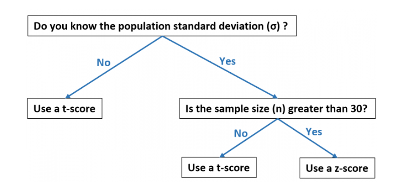

s## **Lecture Notes: Demystifying the Credit Score (T Score) - Your Financial Passport**

**Professor:** Vineet Tiwari

**Course:** Personal Finance & Financial Literacy

**Lecture Topic:** The Credit Score: Understanding, Building, and Maintaining Your Financial Reputation

---

### **1. Introduction: Your Financial Shadow**

Welcome, everyone. Today, we're discussing one of the most powerful and consequential numbers in your adult life: your **credit score**, often colloquially referred to as a "T Score" in the provided material.

This three-digit number is not just an abstract metric; it is your **financial reputation quantified**. It follows you like a shadow, influencing your ability to borrow money, the price you pay for that money (interest rates), and even non-lending decisions like renting an apartment, securing insurance, or sometimes even getting a job. Understanding it is not optional for financial health—it is essential.

---

### **2. What is a Credit Score? The Formal Definition**

A credit score is a statistical number that evaluates a consumer's **creditworthiness**. It is derived from your credit report, which is a history of how you've managed debt and made payments.

*   **Range:** The most common scoring models (FICO® and VantageScore®) range from **300 to 850**.
*   **Purpose:** Lenders (banks, credit card companies, auto financiers) use it to quickly assess the risk of lending you money. A higher score indicates lower risk.
*   **Calculation:** It is calculated by proprietary algorithms developed by companies like Fair Isaac Corporation (FICO) and VantageScore Solutions. The exact formulas are secret, but the key factors and their weights are well-known.

---

### **3. The Five Components of a Credit Score: The Pie Chart**

Your score isn't a mystery. It's built from five key components, each with a different level of importance. Think of it as a pie chart.

#### **1. Payment History (35% - The Largest Slice)**
This is the most important factor. It answers the question: "Do you pay your bills on time?"
*   **What's tracked:** On-time payments for credit cards, mortgages, car loans, student loans, etc.
*   **Negative Impact:** Late payments, accounts sent to collections, bankruptcies, foreclosures, and liens. The more recent, severe, and frequent the delinquency, the greater the damage.
*   **Key Takeaway:** **Always, without exception, pay at least the minimum payment on time.** Set up autopay to avoid mistakes.

#### **2. Amounts Owed / Credit Utilization (30% - The Second Largest Slice)**
This measures how much of your available credit you are using. It indicates if you are over-reliant on debt.
*   **Calculation:** `(Total Credit Card Balances) / (Total Credit Card Limits)`
*   **The Magic Number:** The widely recommended rule is to keep your overall **credit utilization ratio below 30%**. For example, if your total credit limit across all cards is $10,000, try to keep your total balance owed below $3,000 at any given time.
*   **Key Takeaway:** **High balances hurt your score, even if you pay them in full every month** (because the balance is often reported before your payment date). Pay down balances and ask for credit limit increases to improve this ratio.

#### **3. Length of Credit History (15%)**
This factor rewards experience and stability. Longer is better.
*   **What's tracked:** The average age of all your accounts. The age of your oldest account. The age of your newest account.
*   **Key Takeaway:** **Don't close your oldest credit card account,** even if you don't use it often. It's the foundation of your credit history. If you're new to credit, you need to start building history as soon as possible.

#### **4. Credit Mix (10%)**
Lenders like to see that you can responsibly manage different types of credit.
*   **Types of Credit:** Revolving credit (e.g., credit cards) and installment loans (e.g., auto loan, mortgage, student loan).
*   **Key Takeaway:** **You don't need to take out a loan you don't need just to improve your mix.** This is a minor factor. A healthy score can be built with credit cards alone. However, having a diverse mix can help a little.

#### **5. New Credit (10%)**
This factor looks at how often you're applying for and opening new accounts.
*   **Hard Inquiries:** When a lender checks your credit for a lending decision, it results in a "hard inquiry," which can slightly lower your score for a short period.
*   **Rate Shopping:** For auto, mortgage, and student loans, multiple inquiries within a short shopping period (typically 14-45 days) are usually counted as a single inquiry.
*   **Key Takeaway:** **Avoid applying for multiple credit cards or loans in a short timeframe.** Space out your applications.

---

### **4. Why a Good Credit Score is Non-Negotiable**

A strong credit score (generally 670+ for FICO, 700+ is good, 750+ is excellent) unlocks significant financial advantages:

1.  **Lower Interest Rates:** This is the most impactful benefit. On a 30-year mortgage, a difference of even 1% in your interest rate can save you **tens of thousands of dollars** over the life of the loan. The same applies to auto loans and credit card APRs.
2.  **Higher Approval Odds:** Landlords check credit to see if you're a reliable tenant. Utility companies may waive security deposits. Some employers check credit for roles with financial responsibility.
3.  **Access to Premium Products:** The best rewards credit cards, offering cash back, travel points, and perks, are only available to those with excellent credit.
4.  **Bargaining Power:** With a high score, you are in a position to negotiate better terms with lenders.

---

### **5. Building and Rebuilding Your Score: A Strategic Plan**

#### **For Those with No Credit (Students, New Immigrants):**
*   **Secured Credit Card:** Requires a cash deposit that acts as your credit limit. Used responsibly, it reports positive activity to the bureaus and helps you build history.
*   **Become an Authorized User:** A family member with good credit can add you to their old, well-managed credit card account. Their history gets added to your report.
*   **Credit-Builder Loan:** Offered by some credit unions and community banks. The money you "borrow" is held in an account while you make payments, which are reported to the bureaus.

#### **For Those Rebuilding Damaged Credit:**
*   **Get Current:** Focus first on bringing any overdue accounts current.
*   **Pay Down Balances:** The quickest way to improve your score is to reduce your credit utilization ratio.
*   **Goodwill Letters:** For old, paid-off accounts with a few late payments, you can write a "goodwill letter" to the lender asking them to remove the negative mark as a gesture of goodwill.
*   **Patience:** Negative items like late payments have less impact over time and fall off your report entirely after 7 years.

---

### **6. Monitoring and Maintenance: Your Financial Dashboard**

You cannot manage what you do not measure.

*   **Free Annual Reports:** You are entitled to a **free credit report from each of the three major bureaus (Equifax, Experian, and TransUnion) every week** at [AnnualCreditReport.com](https://www.annualcreditreport.com). **You should check these for errors.**
*   **Free Credit Score Access:** Many banks, credit card issuers, and free services like Credit Karma and Credit Sesame provide free access to your credit score (usually a VantageScore) and report information.
*   **Paid Services:** Services like myFICO.com provide your actual FICO scores used by most lenders, along with identity theft protection.

---

### **7. Common Pitfalls and Myths**

*   **MYTH:** Checking your own credit hurts your score.
    *   **TRUTH:** Checking your own credit is a "soft inquiry" and does not affect your score at all.
*   **PITFALL:** Closing old credit cards.
    *   **TRUTH:** This can hurt your average account age and increase your credit utilization ratio, potentially lowering your score.
*   **MYTH:** You need to carry a balance to build credit.
    *   **TRUTH:** This is completely false. You can (and should) pay your balance in full every month to avoid interest charges. The activity of using the card and paying it off is what gets reported.
*   **PITFALL:** Maxing out credit cards.
    *   **TRUTH:** This leads to a very high utilization ratio, which is one of the fastest ways to tank your score.

---

### **8. Key Takeaways and Action Items**

1.  **Your credit score is a measure of risk** based primarily on **payment history** and **credit utilization**.
2.  **A good score saves you money** through lower interest rates and provides more financial opportunities.
3.  **Build your score** by paying all bills on time, every time, and keeping credit card balances low.
4.  **Monitor your credit** regularly for errors and signs of fraud using free resources.
5.  **Building credit is a marathon, not a sprint.** It requires consistent, responsible behavior over time.

**Your financial future is heavily influenced by this number. Take control of it today.**

**Are there any questions?**